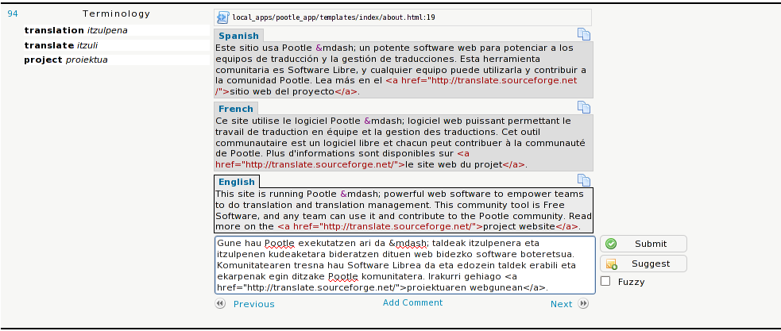

.. _alternative_source_language:

Alternative source language
===========================

Pootle has the ability to display alternative source languages while
translating. Thus, translators who know another language better than English
can take part in the translation project. Also, it provides a way to
disambiguate terminology by seeing how other languages have translated the
same string.

.. _alternative_source_language#setup:

Setup
-----

Users who want to use the functionality need to specify the desired alternative
source languages in their account configuration. Alternatively, Pootle will try
to guess the user's alternative source language by looking at the browser's
``Accept-Lang`` header.

.. note::

    If the selected project doesn't have translations in the alternative
    source language then no alternative will be displayed.

This feature is enabled by default.

.. _alternative_source_language#matching_criteria:

Matching criteria
-----------------

In order to show suggestions from another language, the following is needed:

- The alternative languages must be visible in Pootle and added to the same
  project.

- The string must be translated in the alternative language (not incomplete or
  untranslated).

- The file names need to be identical (identical strings from different files
  are not matched).

- The source text for both translations need to be identical.
