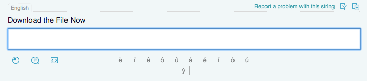
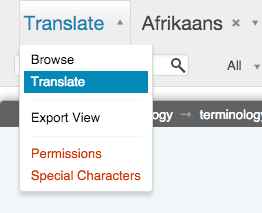
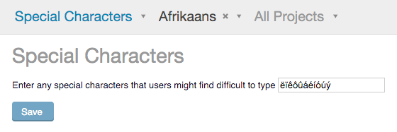

.. _characters#special_characters:

Special characters
==================

Pootle can display clickable characters which might be difficult to type or
unavailable to the translator on their keyboard.  These appear below the
translation widget as we see below for Afrikaans.

Clicking on any of the ``ëïêôûáéíóúý`` characters will insert that character
into the translation.

Many languages, e.g. those using the Latin script with diacritics, will find
this very helpful, especially where keyboard layouts are not readily available.

Adding or altering special characters
-------------------------------------

Anyone with admin rights for Pootle or for a specific language can adjust the
special characters.

To adjust the characters open the Special characters page accesssed via the
admin dropdown in the navigation bar.

Adjust the needed characters by adding and deleting characters.

When to use special characters
~~~~~~~~~~~~~~~~~~~~~~~~~~~~~~

Special characters do not solve the input needs for all languages, but has been
a very useful help for many languages, especially in `translate@thons`.

For people using non-Latin scripts, consider if it will be useful to perhaps
include things that can't be easily typed by translators in your language. You
will probably need to limit the number of characters, but hopefully you can
find a reasonable compromise that will help many people.
