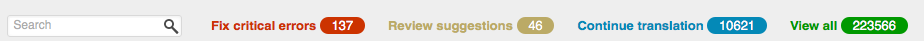
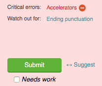

.. _checks:

Quality checks
==============

Pootle provides a powerful way of reviewing translations for quality. It
exposes most of the :ref:`pofilter checks <toolkit:pofilter_tests>` that can
check for several issues that can affect the quality of your translations.

If Pootle indicates a possible problem with a translation, it doesn't mean that
the translation is necessarily wrong, just that you might want to review it.
Pootle administrators should indicate the correct project type (GNOME, KDE,
Mozilla, etc.) in the administration pages. This will improve the accuracy of
the quality checks.

Critical checks are prominently displayed through the browsing UI.

Any extra failing checks can be accessed by clicking the
|icon:icon-expand-stats| button located below the navigation breadcrumbs.
Clicking on the name of a check will step you through the translations that
fail that check.

While in the translation editor, submissions resulting in critical failing
checks will be immediately reported, preventing you from automatically
continuing until the issues have been resolved or muted as false positives by
using the mute |icon:icon-block| button. Non-critical checks flag potential
problems but can be ignored or muted as needed.

To understand the meaning of each check, Pootle displays the failing checks
right on top of the submission button, with a link to the online documentation.
You can also read the detailed descriptions of the :ref:`pofilter checks
<toolkit:test_description>`.

.. _checks#muting_quality_checks:

Muting Quality Checks
---------------------

It is possible to mute the quality check if the translation is correct.
Reviewers are able to remove the check for a certain string, by clicking on the
|icon:icon-block| button, to indicate that the string is correctly translated.
This avoids having to review the same check multiple times.  You can unmute any
muted check using the |icon:icon-block-muted| button.

If the source text of the translation is changed then the mute is discarded to
ensure that the new translation is checked again for any possible issues.
