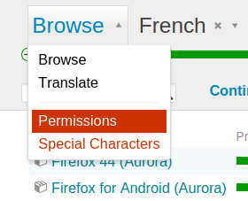
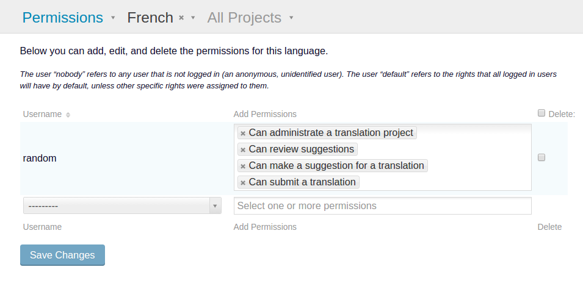

.. _permissions:

User permissions
================

There are several rights which can be assigned to users or to a group of users,
such as to all logged in users. The default site-wide permissions are
configured by the server administrator. These are the permissions that will be
used in each project unless other permissions are configured.

.. _permissions#permissions_precedence:

Permissions precedence
----------------------

Permissions can be customized server-wide, per-language, per-project or
language/project combination (translation project).

Permissions apply recursively, so server-wide permissions will apply to all
languages and projects unless there is a more specific permission. Language
permission applies to all translation projects under that language, etc.

.. _permissions#special_users:

Special users
-------------

Pootle has two special users, *nobody* and *default*, which are used to assign
permissions to more than one user at once. The user *nobody* represents any
non-logged in user, and *default* represents any logged in user.

If a user has permissions assigned to her user account they override any
default permissions even those applied to more specific objects (i.e. a user
who has specific rights on a language will override default rights on
translation projects).

Server administrators can be specified in the users page of the admin section.
Server administrators have full rights on all languages and projects and
override all permissions.

.. _permissions#available_permissions:

Available permissions
---------------------

Access Permissions
^^^^^^^^^^^^^^^^^^

Access rights can be set server-wide or for projects. Bear in mind that
when limiting access to projects the permissions affect to *all the
languages* available in the project.

view
  Gives access to a project.

hide
  Forbids access to a project.

Action Permissions
^^^^^^^^^^^^^^^^^^

Permissions restricting actions can be set server-wide, per language, or
language-project combination:

suggest
  The right to :doc:`suggest <suggestions>` a translation for a specific
  string, also implies the right to upload file using suggest only method.

review
  The right to review the suggested translations and accept or reject them, as
  well as the right to reject false positive quality checks

translate
  The right to supply a translation for a specific string or to replace the
  existing one. This implies the right to upload files using the merge method.

administrate
  The right to administrate the project or language including administer
  permissions and delegating rights to users (this is not the same as the site
  administrator)

.. _permissions#permissions_interface:

Permissions interface
---------------------

Users with administrative rights for projects, languages or translation
projects can access the permissions interface by selecting "Permissions" in the
navigation dropdown on the project, language or translation project browsing
pages.

Pootle administrators will find the default permissions interface on the
administration page, at the "Permissions" tab, where they can set server-wide
permissions.

The current rights are listed as they are assigned. The user "nobody" refers to
any user that is not logged in (an anonymous, unidentified user). The user
"default" refers to the rights that all logged in users will have by default,
unless other specific rights were assigned to them. The rest of the users are
users of the Pootle server for which non-default rights were assigned.

.. _permissions#changing_permissions:

Changing permissions
^^^^^^^^^^^^^^^^^^^^

In the list of permissions, you can simply select which rights must be assigned
to each user by picking new permissions or unassigning them. Changes will be
updated when you submit the form.

.. _permissions#adding_a_user:

Adding a user
^^^^^^^^^^^^^

To set permissions for a specific user, select the user in the dropdown list
and set the specific rights for that user. This is only necessary if the user
does not yet have their own set of rights defined.

.. _permissions#removing_a_user:

Removing a user
^^^^^^^^^^^^^^^

To reset some user's rights to the default rights, select the "Delete" tick box
next to their name and permissions list. When you submit, their rights will be
reset to the default rights.

.. warning::

    A user with administrative rights can remove his own administrative rights.

