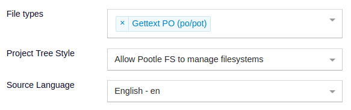

.. _pootle_fs_add_project:

Add a Pootle FS managed project
===============================

Pootle FS can work with different VCS systems as well as with the local file
system.

The following steps outline the setup of a Pootle FS based project:

Install Pootle FS plugins
-------------------------

.. note:: Pootle FS will work out of the box when synchronizing with the local
   file system. If this is the case you can safely skip this step.

Synchronizing against any version control system requires you add some
:ref:`additional packages and configuration <pootle_fs_install_plugins>`.

Create a project to be managed by Pootle FS
-------------------------------------------

Create a project as usual, setting the *Project Tree Style* to
``Allow Pootle FS to manage filesystems``.

Provide Pootle FS configuration for the project
-----------------------------------------------

Once the project is created you need to configure Pootle FS. You can accomplish
this with the command line or the web UI. The UI is by far the simplest way and
is outlined here:

- Click on the ``Filesystems`` link below the project edit form in the project
  admin UI.

  .. image:: ../_static/pootle_fs_link.png

- Add the ``Backend configuration``:

  - Set the *Filesystem backend* to ``localfs`` as we are working against files
    stored on the local filesystem.
  - Set the *Backend URL or path* to point to the translation files on Pootle's
    local filesystem, e.g. ``/path/to/translations/MYPROJECT/``
  - Set the *Translation mapping* for your project, for example
    ``/<language_code>/<dir_path>/<filename>.<ext>``

  .. note:: If you are setting up Pootle FS for a VCS then configure as
     follows:

     - Set the *Filesystem backend* to the required VCS backend.
     - Set the *Backend URL or path* to point to the repository, e.g.
       ``git@github.com:user/repo.git``

- If not all of your project's language codes match those available in Pootle,
  then add language mapping configurations for those languages. For example
  match ``fr_FR`` on your filesystem to ``fr`` on Pootle.

Connect Pootle FS with VCS repository
-------------------------------------

.. note:: You can safely skip this step if you are setting up the project to
   synchronize with the local file system.

- Create a SSH key:

  .. code-block:: console

    $ sudo -u USER-RUNNING-POOTLE ssh-keygen -b 4096

- Tell your upstream repo about the public key, allowing Pootle to be able to
  push to the repo.

  - In GitHub:

    - Either use the public key as a *Deploy key* for the repository on GitHub,
    - Or (**preferred**) add the public key to a GitHub user's *SSH and GPG
      Keys*. In most cases you want to create a specific Pootle GitHub user.

Pull the translations into Pootle
---------------------------------

Once the project is created and properly set up we can pull the translations
into Pootle:

.. code-block:: console

  (env) $ pootle fs state MYPROJECT
  (env) $ pootle fs add MYPROJECT
  (env) $ pootle fs sync MYPROJECT

Next steps
----------

Your project is now ready to use Pootle FS. In order to keep Pootle and the
filesystem or VCS synchronised you will need to learn how to :ref:`use Pootle
FS <using_pootle_fs>`.
