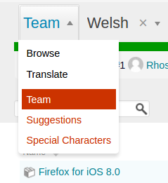
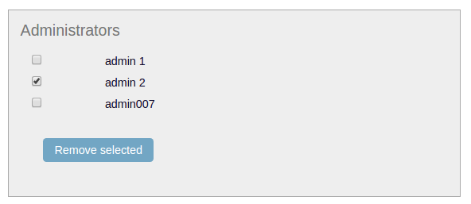

.. _teams:

Teams
=====

Pootle's team page is designed to assist in managing teams. These includes team
members and their roles within the team, and other team related aspects and
features. The team page also provides overall statistics and access to the bulk
handling for pending suggestions.

Language administrators will find the team interface on the first dropdown in
their language's browse page.

The team page is divided in two parts, on the left the management of the team
members and on the right a list of the projects enabled for the language, and
the overall translation statistics with links to the editor and the bulk
suggestions manager.

.. _teams#manage-members:

Managing team members
---------------------

The UI for team members management is divided in two parts:

1. Top left: a form to add new members to the team,
2. Bottom left: the team's members listed within their assigned roles.

.. _teams#roles:

Roles
^^^^^

There are four different roles, which provide incremental permissions within
the team:

Member
  May submit suggestions.

Submitter
  Can translate and make suggestions.

Reviewer
  In addition to translate and submit suggestions, can also review suggestions.

Administrator
  Can administer the team, adding team members and adjusting roles. May edit
  the announcement of the team. Plus all rights of the Reviewer.

.. _teams#add-member:

Adding a member
^^^^^^^^^^^^^^^

.. image:: ../_static/add_team_member.png

Add new members using the form at the top left. Simply, select the user, choose
a role and click **Add team member** button.

.. _teams#remove-member:

Removing a member
^^^^^^^^^^^^^^^^^

To remove members check the box next to their username and then click on the
**Remove selected** button. 

.. _teams#change-member-role:

Changing a member's role
^^^^^^^^^^^^^^^^^^^^^^^^

To change a member's role first remove the member from the team, then add the
member back with the desired role.
