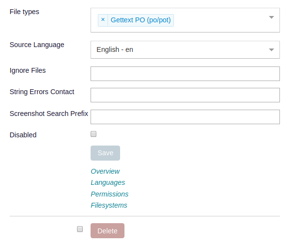

.. _project_setup:

Create a Project
================

Now that you have the server running, you can setup a project to translate on
the server.

Our assumptions
---------------

To simplify the example we assume that:

- The project uses PO files.
- You can copy these files to the Pootle server.
- There is a template file in POT format containing the strings that need to be
  translated.
- The project follows the GNU layout (More information on this is provided
  below).
- Pootle is correctly set up and running.
- There is at least one **rqworker** thread running. This is important.
- You are logged into the Pootle server using your newly created administrator
  user.

.. _project_setup#add-new-project:

Adding a new project
--------------------

.. _project_setup#placing-translation-files:

Placing translation files
+++++++++++++++++++++++++

You need to place the translation files for your new project in a location
where Pootle can find, read and write them. Pootle uses the 
:setting:`POOTLE_TRANSLATION_DIRECTORY` setting to find out where translation
files are stored on the server.

.. note: By default this is the :file:`translations` directory within the
   Pootle codebase, which might be difficult for you to find depending on how
   you installed Pootle. So most likely you want to change this in your custom
   settings file.

Our example project uses a GNU layout.

A GNU layout means that our project contains translation files named using
language codes. Within the project there are no directories, just files. There
can only be a single translation file per language in a project using this
layout.

This is the simplest layout possible and the reason we are using it in our
example.

Below you can see an example with two projects using the GNU layout:

::

    `-- translations
        `-- project1
        |   `-- po
        |       |-- de.po
        |       |-- fr.po
        |       |-- gl.po
        |       |-- pt_BR.po
        |       `-- templates.pot
        `-- project2
            `-- po
                |-- af.po
                |-- eu.po
                |-- pt_BR.po
                |-- templates.pot
                `-- zu.po

Among the regular translation files there are two files named 
:file:`templates.pot`. These are the template (master or reference) files that
contain the original strings. Usually these files contain only English strings,
however it is much less confusing to use the term ``templates`` than e.g.
``en`` or ``English``.

To get started, create a :file:`my-project` directory in the location pointed
to by :setting:`POOTLE_TRANSLATION_DIRECTORY` and place within it the 
translation files for your new project. Make sure you have a
:file:`templates.pot` among those project translation files.

.. _project_setup#creating-the-project:

Creating the project
++++++++++++++++++++

.. note:: If you want to integrate your project with a version control
   system you need to :ref:`install the Pootle FS plugins for the VCS
   <integrate_with_vcs#install-vcs-plugins>` and :ref:`connect Pootle FS with
   the VCS repository <integrate_with_vcs#connect-with-vcs>` before creating
   the project in Pootle.

At the top of the user interface, you will see your newly created administrator
username. Click on it and the main top menu will be displayed, then click on
**Admin** (highlighted in red):

.. image:: ../_static/accessing_admin_interface.png

Now you are in the administration interface. Go to the **Projects** tab and you
will see a **New Project** button:

.. image:: ../_static/add_project_button.png

Click on that button and the **Add Project** form will be displayed. Enter the
new project's details.

**Code** is a unique string that identifies the project. Also you must specify
the **File Types** used in this new project.

The **Filesystem backend** tells Pootle FS how to synchronize the translations
in the project. The default option is ``localfs`` which tells to synchronize
with the disk. Other backends allow to synchronize with version control systems
and they might require the installation of additional Pootle FS plugins.

**Path or URL** either is a path pointing to the translation files on the disk
if you are using the ``localfs`` **Filesystem backend**, or is a URL pointing
to the VCS repository. The path can be an absolute path like
``/path/to/translations/my-project/`` or it can use the
``{POOTLE_TRANSLATION_DIRECTORY}`` placeholder if you are using the ``localfs``
**Filesystem backend**, like ``{POOTLE_TRANSLATION_DIRECTORY}my-project``
(the placeholder will be transparently replaced by the value of the
:setting:`POOTLE_TRANSLATION_DIRECTORY` setting). If you are using a
**Filesystem backend** that uses a URL instead of a Path, for example for the
**Git** backend, this would be like ``git@github.com:user/repo.git`` for a
GitHub repository.

The **Path mapping** field specifies the project layout using a glob like
``/path/to/translation/files/<language_code>/<dir_path>/<filename>.<ext>`` that
must start with ``/``, end with ``.<ext>``, and contain ``<language_code>``
(the rest of the placeholders are optional). If you are using the ``localfs``
**Filesystem backend** the **Path mapping** will be combined with the path
specified in the **Path or URL** field. For other backends it will be relative
to the root of the repository. Note you can easily fill this field by selecting
one of the available **Path mapping presets**.

You can also provide a **Full Name** easily readable for humans, if not the
**Code** will be used. You don't need to change the rest of the fields unless
you need to further customize your project.

.. note:: If you are creating a project that is integrated with a version
   control repository then configure as follows:

   - Set the **Filesystem backend** to the required VCS backend.
   - Set the **Path or URL** to point to the repository, e.g.
     ``git@github.com:user/repo.git`` for a GitHub repository.

In our example set the following:

- **Code** to ``my-project``.
- **Full Name** to ``My project``
- **File Types** to ``Gettext PO (po/pot)``.
- **Filesystem backend** to ``localfs``.
- **Path or URL** to ``{POOTLE_TRANSLATION_DIRECTORY}my-project``.
- **Path mapping preset** to ``GNU style``.

.. image:: ../_static/add_project_form.png

Once you are done click on the **Save** button below the form to create the
project and save its Pootle FS configuration.

.. _project_setup#specify-language-codes-mapping:

Specify language codes mapping
++++++++++++++++++++++++++++++

If not all of your project's language codes **do not match** those available in
Pootle, then you must add language mapping configurations for those languages.
You can do that by clicking on the **Languages** link that is displayed below
your project form:

The existing languages enabled for the project are listed, including an
**optional** mapping to the language code used in the filesystem. In the
screenshot below you can see that ``fr_FR`` on filesystem maps to ``fr`` on
Pootle:

.. image:: ../_static/enable_new_tp_through_admin_UI.png

In our example this form won't list any language, so you must add new entries
for the languages that need to be mapped specifying their **Filesystem language
code** field.

.. _project_setup#import-translations:

Import the translations
+++++++++++++++++++++++

Creating the project doesn't actually import all the translations to Pootle. To
do that you need to run the following on the command line of the Pootle server:

.. code-block:: console

    (env) $ pootle fs fetch my-project
    (env) $ pootle fs state my-project
    (env) $ pootle fs add my-project
    (env) $ pootle fs sync my-project

.. note::  Read the :ref:`using Pootle FS <using_pootle_fs>` instructions in
   order to learn more about Pootle FS usage.

This will import all the translations from disk into Pootle, calculate the
translation statistics and calculate the quality check failures. This might
take a while for a large project.

Looking at your new project you will see that Pootle has imported all the
existing translations for the existing languages that you copied to the
:file:`my-project` directory within :setting:`POOTLE_TRANSLATION_DIRECTORY`.

.. _project_setup#initialize-new-tp:

Enable translation to a new language
------------------------------------

When you want to add a new language to the project, follow these steps.

Go to your project overview and select **Languages** in the navigation
dropdown:

.. image:: ../_static/languages_in_project_dropdown.png

.. note:: Alternatively you can get the same result by clicking on the
   **Languages** link that is displayed below your project form in the
   administration interface:

   .. image:: ../_static/project_form_bottom_links.png

The existing languages enabled for the project are listed, including an
**optional** mapping to the language code used in the filesystem (in the
screenshot below you can see that ``fr_FR`` on filesystem maps to ``fr`` on
Pootle). In our example we are adding **Arabic** to the project:

.. image:: ../_static/enable_new_tp_through_admin_UI.png

When you click the **Save** button the new language will be added for
translation. In large projects it may take some time to create the new
translation files from the ``templates``.

.. note:: If you want to enable translation to a language that doesn't yet
   exist in your Pootle instance, then you will first have to add the language
   in the **Languages** tab in the administration interface, in a similar way
   to :ref:`creating a new project <project_setup#creating-the-project>`.

   Once the language is created you can enable translation to that new language
   in any project by following the instructions above.

.. _project_setup#updating-strings:

Updating strings for existing project
-------------------------------------

Whenever developers introduce new strings, deprecate older ones, or change some
of them this impacts Pootle and the languages being translated.

When any of these changes occur, you will need to generate a new
:file:`templates.pot` and use it to bring the translations in Pootle up-to-date
with the new templates.

Once you have created the new :file:`templates.pot` place it within your
project's directory in :setting:`POOTLE_TRANSLATION_DIRECTORY`, replacing the
file with the same name. After that, invoke the following command which will
update the template translations in the Pootle database.

.. code-block:: console

    (env) $ pootle update_stores --project=my-project --language=templates

This command will ensure that new strings are added to the project and any
strings which have been removed are marked as deprecated, and thus will not be
available for translation.

Now each of the languages will need to be brought into sync with the template
language. The first step is to save all the Pootle translations to disk:

.. code-block:: console

    (env) $ pootle sync_stores --project=my-project

Then update all those translations on disk against the newer templates. We
recommend you to update them on disk using the :ref:`pot2po <toolkit:pot2po>`
command line tool because it can handle other formats besides Gettext PO.

.. code-block:: console

    (env) $ cd $POOTLE_TRANSLATION_DIRECTORY  # Use the actual path!
    (env) $ cd my-project
    (env) $ pot2po -t af.po templates.pot af.po  # Repeat for each language by changing the language code.

.. note:: To preserve the existing translations we pass the previous
   translation file to the ``-t`` option.

When all the languages in the project have been updated you can push them back
to Pootle:

.. code-block:: console

    (env) $ pootle update_stores --project=my-project

.. note:: If your project languages contain many translations you might want to
   perform the update against newer templates on a language by language basis.
