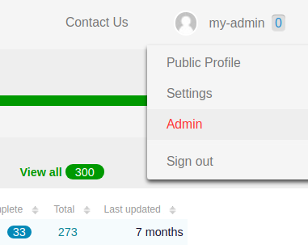
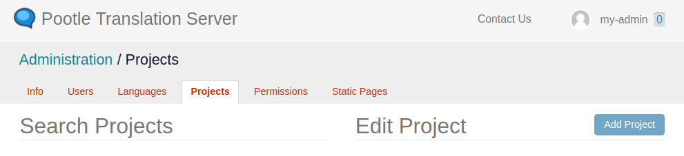
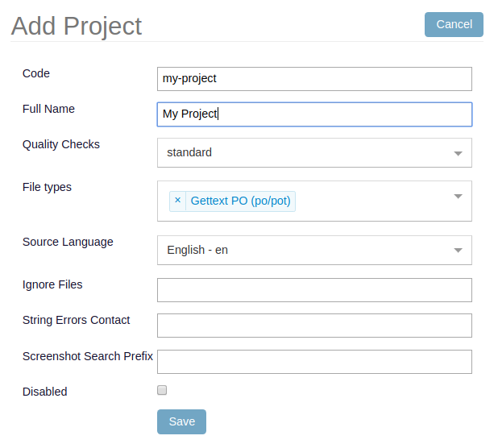
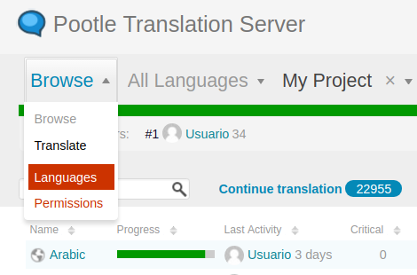
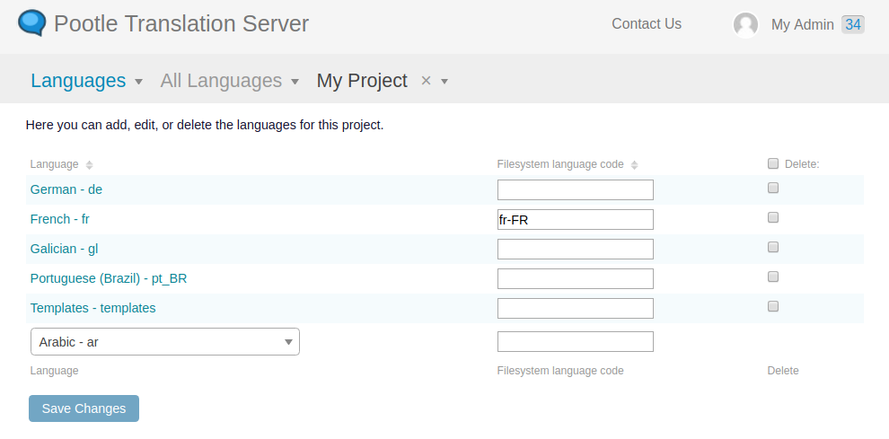

.. _project_setup:

Create a Project
================

Now that you have the server up and running, this guide will help you get
started with Pootle setup for getting translations.

Assumptions
-----------

- We are setting up a project which consists of PO files and you have them on
  hand.
- You have a POT file with the strings you want to get translated.
- The files are using the GNU layout, more about that later.
- Pootle is correctly set up and running.
- There is at least some **rqworker** running. This is important.
- You are logged in using your newly created administrator user.

.. _project_setup#add-new-project:

Adding a new project
--------------------

.. _project_setup#place-translation-files:

Place translation files
+++++++++++++++++++++++

First task is to place the translation files for your new project in a location
where Pootle can find, write and read them. Pootle is told about this location
by using the :setting:`POOTLE_TRANSLATION_DIRECTORY` setting.

.. note: You probably would like to set a different value for
   :setting:`POOTLE_TRANSLATION_DIRECTORY` in the custom settings file
   generated by the :djadmin:`init` command. By default it is the
   :file:`translations` directory within Pootle codebase, which might be
   difficult for you to find depending on how you installed Pootle.

As told above, we will be using a GNU layout for the examples. A GNU layout
means that a given project contains only translation files named by its
language code. That means that within that project there are no directories,
just files. This is the simplest layout possible. Below you can see an example
with two projects using the GNU layout:

::

    `-- translations
        `-- project1
        |   |-- de.po
        |   |-- fr.po
        |   |-- gl.po
        |   |-- pt_BR.po
        |   `-- templates.pot
        `-- project2
            |-- af.po
            |-- eu.po
            |-- pt_BR.po
            |-- templates.pot
            `-- zu.po

You might have noticed that among the regular translation files there are two
files named :file:`templates.pot`. These are the master files that contain the
original strings. Usually these master files contain English strings, but we
find much less confusing to use ``templates`` instead of ``en`` (language code
for English).

Create a :file:`my-project` directory in the location pointed to by
:setting:`POOTLE_TRANSLATION_DIRECTORY` and place within it the translation
files for your new project. Make sure you have a :file:`templates.pot` among
those project translation files.

.. _project_setup#create-new-project:

Creating the project
++++++++++++++++++++

In the top side of the interface you should see your newly created
administrator username. Click on it and the main top menu will be displayed,
and then click on **Admin** item (highlighted in red):

Now you are in the administration interface. Within the **Projects** tab you
will see a **New Project** button:

Click on that button and the **Add Project** form will be presented to you.
Fill it with the new project details. **Code** must match the name for the
directory within :setting:`POOTLE_TRANSLATION_DIRECTORY` that contains the new
project translation files, in our example :file:`my-project`. You can also
provide a **Full Name** easily readable for humans. You don't need to change
the rest of the fields unless you need to further customize your project.

Once you are done click on the **Save** button below the form to create the
project. Creating the project doesn't actually import all the translations to
Pootle, so you also need to run :djadmin:`update_stores`:

.. code-block:: console

    pootle update_stores --project=my-project

This will import all the translations from disk into Pootle, calculate the
translation statistics and calculate the quality check failures. This might
take a while if your project is large.

.. _project_setup#initialize-new-tp:

Enable translation to a new language
------------------------------------

Your main reason for using Pootle probably is to get something translated to as
many languages as possible in a simple way. So you will usually be enabling the
translation to new languages in your project.

To enable translating your project to a new language go to your project
overview. Then select the **Languages** item in the navigation dropdown and
click on it:

.. note:: Alternatively you can get the same result by clicking on the
   **Languages** link that is displayed below your project form in the
   administration interface:

   .. image:: ../_static/project_form_bottom_links.png

You are presented with a form listing all the existing languages. Here you can
add a new language. In this example the **Arabic** language is selected to be
enabled:

After you click on the **Save** button, the new language will be enabled for
translation. In large projects it might take a bit to create the new
translation files on disk and initialize the translations from the
**Templates** language.

.. note:: If you want to enable translation to a language that doesn't yet
   exist in your Pootle instance, then you will have to first add the language
   in the **Languages** tab in the administration interface, in a similar way
   to :ref:`creating a new project <project_setup#create-new-project>`.

   Then you can enable translation to that new language in any project by
   following the instructions above.

.. _project_setup#add-new-strings:

Adding new strings to existing project
--------------------------------------

Whenever you update your software and thus you have more strings for
translators to translate, you will be generating a new :file:`templates.pot`.
You must place that file within your project's directory in
:setting:`POOTLE_TRANSLATION_DIRECTORY`, replacing the file with the same name.
Then run the following so Pootle picks up the new changes:

.. code-block:: console

    pootle update_stores --project=my-project --language=templates

.. note:: Note that doing this won't automatically update the other languages
   in the project. We recommend you to update them on disk using
   :ref:`pot2po <toolkit:pot2po>` (which can handle other formats besides
   Gettext PO), and run :command:`update_stores --project=my-project` for
   Pootle to get the languages updated.

   It is advisable to first save to disk the translations in Pootle database by
   running :command:`sync_stores --project=my-project`.
